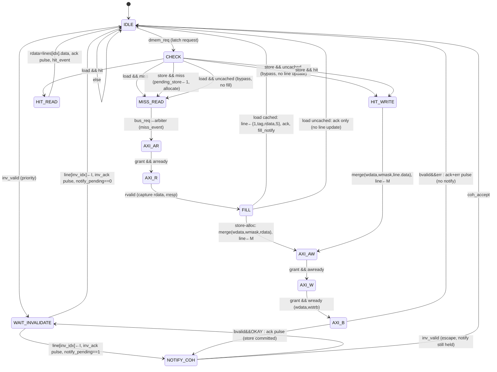

# 04 — D-Cache FSM (T1.2): `d_cache.sv` + `d_cache_mgr.sv`

Acceptance: *all states, transitions, reset values defined*. This is the most complex module in the
SoC (TRD §3.3): per-core private direct-mapped write-through cache; the manager (mgr) implements the
hit/miss/write/invalidate policy and is also the SoC's only kind of AXI4-Lite **master**.

Two files:
- `d_cache.sv` — line **storage**: 4 registers of `{valid, tag, data, coh_state}` + lookup mux.
- `d_cache_mgr.sv` — the **FSM** + AXI-Lite master + coherence sideband + core handshake.

---

## 4.1 Geometry and address breakdown

| Parameter | Value |
|-----------|-------|
| Lines | 4 (direct-mapped) |
| Line size | 1 word (32-bit) |
| Write policy | write-through + write-allocate |
| States | I=`2'b00`, S=`2'b01`, M=`2'b10` |

```
addr[31:0]   ├─── tag[31:4] (28b) ───┤┤idx[3:2]┤┤byte[1:0]┤
             used for hit compare     4 lines    byte lane (core-side use)
```

## 4.2 Cache line structure and lookup equations

```systemverilog
typedef struct packed {
  logic        valid;
  logic [27:0] tag;
  logic [31:0] data;
  logic [1:0]  coh_state;
} cache_line_t;

cache_line_t lines [4];     // one register per line
```

Lookup (combinational, using the request address):

```
idx  = req_addr[3:2]
hit  = lines[idx].valid && (lines[idx].tag == req_addr[31:4]) && (lines[idx].coh_state != I)
```

Invariant (asserted in TB): `lines[i].valid == (lines[i].coh_state != I)` — `valid` is redundant but
kept per TRD and checked.

## 4.3 Interfaces

### Core side (req/ack, stalls the core)

| Signal | Dir | Description |
|--------|-----|-------------|
| `dmem_req` | in | request (level, held until `dmem_ack`) |
| `dmem_we` | in | 1=store, 0=load |
| `dmem_addr[31:0]` | in | byte address |
| `dmem_wdata[31:0]` | in | store data, already lane-rotated by core (doc 03 §6) |
| `dmem_wmask[3:0]` | in | byte enables, already lane-rotated |
| `dmem_rdata[31:0]` | out | load data (valid with `ack`) |
| `dmem_ack` | out | 1-cycle commit pulse |
| `dmem_err` | out | 1-cycle, with `ack` (R5) |

### AXI4-Lite master (muxed into the arbiter; see doc 06)

Standard 5 channels (`awvalid/awaddr/awready`, `wvalid/wdata/wstrb/wready`, `bvalid/bresp/bready`,
`arvalid/araddr/arready`, `rvalid/rdata/rresp/rready`). Sequencing rule used by this master:
**AW → W → B** and **AR → R** strictly (one transaction at a time per grant).

### Coherence sideband (per R1/R2, doc 05)

| Signal | Dir | Description |
|--------|-----|-------------|
| `write_notify` | out | held high in NOTIFY_COH until `coh_accept` |
| `write_addr[31:0]` | out | address written (valid with `write_notify`) |
| `coh_accept` | in | coherence FSM captured the notify (1-cycle pulse) |
| `inv_valid` | in | invalidate request (held until `inv_ack`) |
| `inv_idx[1:0]` | in | line index to invalidate |
| `inv_ack` | out | 1-cycle pulse, invalidation performed |
| `fill_notify` | out | 1-cycle pulse with `fill_idx[1:0]` when a line fills to S (R2) |

### Events (to counters/LEDs, doc 09/12)

`hit_event` (pulse, HIT_READ), `miss_event` (pulse, MISS_READ), `err_event` (pulse, any err).

## 4.4 FSM — state diagram

13 states, matching TRD §3.3 names. Encoding: 4-bit binary as listed in §4.5.
Main spine (core-transaction path), with `WAIT_INVALIDATE` reachable from both `IDLE` and `NOTIFY_COH`:

```
                 inv_valid           dmem_req
   ┌──────┐    ┌──────────────┐    ┌─────────┐   load&hit  ┌──────────┐
   │ IDLE │───►│WAIT_INVALIDATE│   │  CHECK  │────────────►│ HIT_READ │─── rdata,ack ──┐
   │(rst) │    │ line←I,       │   │ (decode │             └──────────┘                ▼
   └──┬───┘    │ inv_ack pulse │   │  req)   │   store&hit ┌───────────┐             (IDLE)
      │        └──────┬───────┘   └────┬────┘────────────►│ HIT_WRITE │── merge,→M ──┐
      │ dmem_req      │ ▲              │                   └───────────┘              │
      ▼               │ └── notify_pending (return from NOTIFY_COH escape)            │
   ┌─────────┐        │                │ load&miss / store&miss (pending_store=1)    │
   │MISS_READ│        │                ▼                                             │
   └────┬────┘        │        ┌────────┐    ┌────────┐    ┌──────┐                   │
        └─────────────┼───────►│ AXI_AR │───►│ AXI_R  │───►│ FILL │                   │
                      │        └────────┘ ar │        │ rv └──┬───┘                   │
                      │                      │        │       │ load: line←S,rdata,ack│──►(IDLE)
                      │                      │        │       │ store:merge,→M        │
                      │                      │        │       └──────────┐            │
                      │                      │        │                  ▼            │
                      │        ┌────────┐    │        │   ┌────────┐  ┌───────┐       │
                      └────────│NOTIFY_ │◄───┼────────┼───│ AXI_AW │─►│ AXI_W │─►┌──────┐
   write_notify held ─────────►│  COH   │    │        │   └────────┘aw│       │w │ AXI_B│
   until coh_accept            └───┬────┘    │        │               └───────┘  └──┬───┘
                                   │         └────────┘                             │ bvalid
                                   │ coh_accept                                     ▼
                                   └─────────────────────────────────────► (IDLE)
                                                          (bresp err: AXI_B → IDLE with ack+err)
```

### Mermaid (renders on GitHub)



> Implementation note: `WAIT_INVALIDATE` has a **single exit rule**: `notify_pending ? NOTIFY_COH : IDLE`.
> Entered from IDLE (`notify_pending=0`) it returns to IDLE; entered from NOTIFY_COH (escape) it returns
> to NOTIFY_COH. One state, no extra return-state needed.

## 4.5 State encodings and reset values

| State | Encoding | Registered action on entry |
|-------|----------|---------------------------|
| IDLE | 4'd0 | — (reset state) |
| CHECK | 4'd1 | — |
| HIT_READ | 4'd2 | — |
| MISS_READ | 4'd3 | `miss_event` pulse |
| AXI_AR | 4'd4 | — |
| AXI_R | 4'd5 | — |
| FILL | 4'd6 | (array write, §4.6) |
| HIT_WRITE | 4'd7 | (array write, §4.6) |
| AXI_AW | 4'd8 | — |
| AXI_W | 4'd9 | — |
| AXI_B | 4'd10 | — |
| NOTIFY_COH | 4'd11 | `notify_pending←1` |
| WAIT_INVALIDATE | 4'd12 | `line[inv_idx] ← I` (valid=0), `inv_ack` pulse |

Reset (`rst_n` async low): `state←IDLE`, all 4 lines `{valid←0, coh_state←I, tag←0, data←0}`,
`notify_pending←0`, `pending_store←0`, `bypass←0`, latched request regs ← 0, AXI outputs ← 0.

## 4.6 Complete transition table (every state × every condition → next state + outputs)

Latched at IDLE→CHECK: `l_addr`, `l_wdata`, `l_wmask`, `l_we`. Derived: `l_idx=l_addr[3:2]`,
`l_tag=l_addr[31:4]`, `l_hit` per §4.2. Merge: `merged = (l_wdata & {4{l_wmask}}) | (old & ~{4{l_wmask}})`
per byte lane.

| # | State | Condition | Next | Registered actions (at clock edge) | Outputs (same cycle) |
|---|-------|-----------|------|-------------------------------------|----------------------|
| 1 | IDLE | `inv_valid` | WAIT_INVALIDATE | — | — |
| 2 | IDLE | `!inv_valid && dmem_req` | CHECK | latch `l_addr/l_wdata/l_wmask/l_we`, `l_uncached = (l_addr[31:12] != 0)` (R9) | — |
| 3 | IDLE | else | IDLE | — | — |
| 4 | WAIT_INVALIDATE | (any) | `notify_pending ? NOTIFY_COH : IDLE` | `lines[inv_idx] ← {valid:0, tag:keep, data:keep, state:I}` | `inv_ack=1` (pulse) |
| 5 | CHECK | `l_we && l_uncached` | HIT_WRITE | `bypass←1` (no line update later) | — |
| 6 | CHECK | `l_we && !l_uncached && l_hit` | HIT_WRITE | `bypass←0` | — |
| 7 | CHECK | `l_we && !l_uncached && !l_hit` | MISS_READ | `pending_store←1, bypass←0` | — |
| 8 | CHECK | `!l_we && l_uncached` | MISS_READ | `pending_store←0, bypass←1` | — |
| 9 | CHECK | `!l_we && !l_uncached && l_hit` | HIT_READ | — | — |
| 10 | CHECK | `!l_we && !l_uncached && !l_hit` | MISS_READ | `pending_store←0, bypass←0` | — |
| 11 | HIT_READ | (any) | IDLE | — | `dmem_rdata=lines[l_idx].data`, `dmem_ack=1`, `hit_event=1` |
| 12 | MISS_READ | (any) | AXI_AR | — | `bus_req=1` |
| 13 | AXI_AR | granted && `arready` | AXI_R | — | `arvalid=1, araddr=l_addr` |
| 14 | AXI_AR | else | AXI_AR | — | `bus_req=1, arvalid=1, araddr=l_addr` (hold) |
| 15 | AXI_R | `rvalid` | FILL | capture `axi_rdata`, `axi_err=(rresp!=OKAY)` | `rready=1` |
| 16 | AXI_R | else | AXI_R | — | `bus_req=1, rready=1` (hold) |
| 17 | FILL | `!pending_store && !bypass && !axi_err` | IDLE | `lines[l_idx] ← {1, l_tag, axi_rdata, S}` | `dmem_rdata=axi_rdata`, `dmem_ack=1`, `fill_notify=1, fill_idx=l_idx` |
| 18 | FILL | `!pending_store && bypass && !axi_err` | IDLE | **no line update** (uncached read, R9) | `dmem_rdata=axi_rdata`, `dmem_ack=1` |
| 19 | FILL | `!pending_store && axi_err` | IDLE | **no line update** (stays I) | `dmem_ack=1, dmem_err=1`, `err_event=1` |
| 20 | FILL | `pending_store && !bypass && !axi_err` | AXI_AW | `lines[l_idx] ← {1, l_tag, merge(axi_rdata), M}` | `fill_notify=1, fill_idx=l_idx`* |
| 21 | FILL | `pending_store && axi_err` | IDLE | no line update | `dmem_ack=1, dmem_err=1`, `err_event=1` |
| 22 | HIT_WRITE | `!bypass` | AXI_AW | `lines[l_idx] ← {1, l_tag, merge(lines[l_idx].data), M}` | — |
| 23 | HIT_WRITE | `bypass` | AXI_AW | **no line update** (uncached store, R9) | — |
| 24 | AXI_AW | granted && `awready` | AXI_W | — | `awvalid=1, awaddr=l_addr` |
| 25 | AXI_AW | else | AXI_AW | — | `bus_req=1, awvalid=1, awaddr=l_addr` (hold) |
| 26 | AXI_W | granted && `wready` | AXI_B | — | `wvalid=1, wdata=l_wdata, wstrb=l_wmask` |
| 27 | AXI_W | else | AXI_W | — | `bus_req=1, wvalid=1, wdata, wstrb` (hold) |
| 28 | AXI_B | `bvalid && bresp==OKAY && !bypass` | NOTIFY_COH | `notify_pending←1` | `dmem_ack=1` (store committed), `bready=1` |
| 29 | AXI_B | `bvalid && bresp==OKAY && bypass` | IDLE | — | `dmem_ack=1` (no coherence notify for MMIO, R9), `bready=1` |
| 30 | AXI_B | `bvalid && bresp!=OKAY` | IDLE | — | `dmem_ack=1, dmem_err=1`, `err_event=1`, `bready=1` |
| 31 | AXI_B | `!bvalid` | AXI_B | — | `bus_req=1, bready=1` (hold) |
| 32 | NOTIFY_COH | `inv_valid` | WAIT_INVALIDATE | — | `write_notify=1, write_addr=l_addr` (hold) |
| 33 | NOTIFY_COH | `!inv_valid && coh_accept` | IDLE | `notify_pending←0` | (write_notify deasserts after this edge) |
| 34 | NOTIFY_COH | `!inv_valid && !coh_accept` | NOTIFY_COH | — | `write_notify=1, write_addr=l_addr` (hold) |

\* Row 20: the store-alloc fill is to S→M immediately; the coherence mirror records S from
`fill_notify`, then M from the notify a few cycles later — final value M, consistent either way.

### R9: uncached (MMIO) accesses — why rows 5/8/18/23/29 exist

Everything outside `0x0000_0000–0x0000_0FFF` (MMIO/UART/GPIO/DECERR) **must bypass the cache**:
MMIO reads carry side effects (DOORBELL polling, `RX_DATA` read-clears-valid) and would otherwise
return stale cached values forever (first read fills the line, every later poll hits it). Likewise a
write to a non-SRAM address has no cache copy anywhere, so no coherence notify is sent and no line is
touched. The flag `l_uncached` is latched with the request; cached (SRAM) behavior is completely
unchanged. Uncached loads travel the miss path but never fill; they are counted as misses.

## 4.7 Output summary by state (Moore-style, for RTL translation)

| Outputs | States where asserted |
|---------|----------------------|
| `dmem_ack` | HIT_READ, FILL(load path, cached or uncached), AXI_B(OKAY) |
| `dmem_err` | FILL(err), AXI_B(err) |
| `dmem_rdata` | HIT_READ, FILL(load) |
| `bus_req` | MISS_READ, AXI_AR, AXI_R, HIT_WRITE, AXI_AW, AXI_W, AXI_B |
| `arvalid/araddr` | AXI_AR (hold until `arready`+grant) |
| `rready` | AXI_R (hold until `rvalid`) |
| `awvalid/awaddr` | AXI_AW (hold) |
| `wvalid/wdata/wstrb` | AXI_W (hold) |
| `bready` | AXI_B (hold) |
| `write_notify/write_addr` | NOTIFY_COH (hold until `coh_accept`) |
| `inv_ack` | WAIT_INVALIDATE (pulse) |
| `fill_notify/fill_idx` | FILL (pulse, cached S fill only — never for uncached loads) |
| `hit_event` / `miss_event` / `err_event` | HIT_READ / MISS_READ / any err path |

## 4.8 Why this is deadlock-free (needed for the coherence proofs)

1. Every AXI wait (AXI_AR/R/AW/W/B) is bounded: the arbiter eventually grants (`bus_req` is held) and
   every slave responds in bounded time (1–4 cycles; DECERR slave included) — doc 06/07.
2. `WAIT_INVALIDATE` is 1 cycle and has priority in IDLE, so `inv_valid` is never starved.
3. The only unbounded wait is `NOTIFY_COH` (waits for `coh_accept`); it **escapes to service
   `inv_valid` first**, breaking the 3-way cycle mgr1-waits-accept / coherence-waits-inv_ack /
   inv_ack-waits-IDLE (R1). Trace: doc 13 §13.7.
4. The core is stalled while the mgr is busy (`dmem_req` level, ack only at commit), so requests are
   never dropped or overlapped.

## 4.9 Timing note

Critical path into the FSM: `dmem_addr → tag compare + state check (CHECK decision)`. Keep the lookup
purely register→comparator→mux (no added logic levels). This is the SoC's second critical path after
the ALU (doc 02 §6).

## 4.10 Edge cases pinned down

- Store to a line in M or S: HIT_WRITE, stays/becomes M, write-through proceeds. ✔ FR-2.5
- Load from a line in M: HIT_READ (M is a readable up-to-date copy). ✔
- Load from I line (incl. after invalidation): miss → refetch → S. ✔ FR-2.4 / FR-3.4
- Store miss: allocate (read-merge) then write-through, ends M. ✔ R3/O2
- `inv_valid` for the line of an in-flight transaction **cannot occur** (the remote write that caused
  it cannot complete its B while the arbiter grant is held by us — see doc 06 §6.5); invalidations for
  *other* lines arriving mid-transaction are deferred until IDLE (`inv_valid` is held by the
  coherence FSM until `inv_ack`, doc 05).
- Uncached accesses (MMIO/UART/GPIO/DECERR): loads never fill (side-effect reads like `RX_DATA` and
  DOORBELL polls stay live), stores never notify (no cache copy exists anywhere). See R9 rows
  §4.6. Only SRAM-range writes participate in coherence.
- Reset marks every line I — the reset directed test reads all 8 coherence entries as I. ✔ AC-9
