# 05 — Coherence Controller FSM (T1.3): `coherence_ctrl.sv`

Acceptance: *I/S/M transitions + invalidation path defined*. One controller serves both cores. It
(a) keeps the per-line, per-core coherence view (FR-3.4), (b) on every write-through, invalidates the
**other** core's cached copy of that line (FR-3.3), and (c) exports status/counters for MMIO (FR-6.1).

This is the intellectual core of the project — stale data must never survive an invalidation, and no
invalidation may be missed or spurious.

---

## 5.1 Interface

| Signal | Dir | W | Description |
|--------|-----|---|-------------|
| `write_notify0/1` | in | 1 | core N completed a write-through (level, held until `coh_accept`, R1) |
| `write_addr0/1` | in | 32 | address written (valid with notify) |
| `coh_accept0/1` | out | 1 | 1-cycle pulse: notify captured (R1) |
| `fill_notify0/1` | in | 1 | core N filled a line to S (1-cycle pulse, R2) |
| `fill_idx0/1` | in | 2 | line index of the fill |
| `inv_valid0/1` | out | 1 | invalidate request to cache N (**held until `inv_ack`**) |
| `inv_idx0/1` | out | 2 | line index to invalidate |
| `inv_ack0/1` | in | 1 | cache N performed the invalidation (1-cycle pulse) |
| `state0_i[1:0]×4 / valid0_i×4` | in | 12 | **actual** line states of cache 0 (dispatch truth, R6) |
| `state1_i[1:0]×4 / valid1_i×4` | in | 12 | actual line states of cache 1 |
| `coh_enable` | in | 1 | CONTROL bit 0 (MMIO); 0 suppresses invalidations (test support) |
| `inv_fire` | out | 1 | 1-cycle pulse: invalidation dispatched (INV_COUNT, LED2) |
| `coh_status[15:0]` | out | 16 | 8 × 2-bit mirror, for MMIO COH_STATUS |

## 5.2 The 8-entry mirror (4 lines × 2 cores)

```systemverilog
logic [1:0] mirror [2][4];   // mirror[core][line], encoding I/S/M
// reset: all entries = I
```

Update rules (only three):

| Event | Update |
|-------|--------|
| `write_notify` accepted from core N, line `w_idx` | `mirror[N][w_idx] ← M` |
| `inv_ack` from core N | `mirror[N][inv_idx] ← I` |
| `fill_notify` from core N | `mirror[N][fill_idx] ← S` |

`COH_STATUS[15:0] = {mirror[1][3],mirror[1][2],mirror[1][1],mirror[1][0],
                      mirror[0][3],mirror[0][2],mirror[0][1],mirror[0][0]}`

O4 consistency: the directed TB asserts `mirror == {actual cache states}` every cycle.

## 5.3 Dispatch decision

On an accepted write by core N to `w_idx`:

```
other = ~N
remote_has_copy = mirror[other][w_idx] != I        // tracker view
                 || (actual: valid[other][w_idx] && state[other][w_idx] != I)   // R6 truth
```

Dispatch invalidation **iff `remote_has_copy && coh_enable`**. Reading the actual cache state (R6)
makes the decision correct even if the mirror were momentarily stale; the mirror remains the MMIO view
and the O4 assertion target. Directed test 8 ("no cached copy → no spurious invalidate") keys off this
exact condition.

## 5.4 FSM — state diagram

4 states. Encoding: 2-bit.

```
                      ┌──────────────────────────────────────────────┐
                      │                COH_IDLE (reset)              │
                      └───┬──────────────────────────────┬───────────┘
          write_notify0   │                              │   write_notify1
          (priority)      │                              │   (only if !notify0)
                      ┌───▼─────────────┐                │
  coh_accept0 pulse   │ PROCESS_WRITE   │◄───────────────┘   (same behavior, other core)
  mirror[N][idx]←M    │ lookup idx,     │
                      │ decide dispatch │
                      └───┬─────────┬───┘
        remote==I or      │         │  remote!=I && coh_enable
        !coh_enable       │         │
                 ┌────────▼─┐   ┌───▼──────────────────┐
                 │ COH_IDLE │   │ INVALIDATE_OTHER     │
                 └──────────┘   │ inv_valid[other]=1   │──── inv_fire pulse ──► INV_COUNT++
                                │ inv_idx[other]=idx   │
                                └───────┬──────────────┘
                                        │ (hold)
                                ┌───────▼──────────────┐
                                │ WAIT_INV_ACK         │
                                │ mirror[other][idx]←I │◄─── (inv_valid held until ack)
                                └───────┬──────────────┘
                                  inv_ack[other]
                                        │
                                        ▼
                                    COH_IDLE
```

### Mermaid

```mermaid
stateDiagram-v2
    [*] --> COH_IDLE
    COH_IDLE --> PROCESS_WRITE : write_notify0 (coh_accept0 pulse) / write_notify1 (coh_accept1 pulse)
    COH_IDLE --> COH_IDLE : else
    PROCESS_WRITE --> COH_IDLE : mirror[N][idx]←M ; (remote==I || !coh_enable)
    PROCESS_WRITE --> INVALIDATE_OTHER : remote!=I && coh_enable
    INVALIDATE_OTHER --> WAIT_INV_ACK : inv_valid[other]←1, inv_idx[other]←idx, inv_fire pulse
    WAIT_INV_ACK --> COH_IDLE : inv_ack[other] : mirror[other][idx]←I, inv_valid[other]←0
    WAIT_INV_ACK --> WAIT_INV_ACK : else (inv_valid held)
```



## 5.5 State encodings, reset values

| State | Encoding | Reset value |
|-------|----------|-------------|
| COH_IDLE | 2'b00 | yes |
| PROCESS_WRITE | 2'b01 | |
| INVALIDATE_OTHER | 2'b10 | |
| WAIT_INV_ACK | 2'b11 | |

Reset: state ← COH_IDLE, `mirror[*][*] ← I`, `inv_valid0/1 ← 0`, `INV_COUNT ← 0`.

## 5.6 Complete transition table

`n` = notified core, `o` = other core, `w_idx = write_addr_n[3:2]`.

| State | Condition | Next | Registered actions | Outputs (same cycle) |
|-------|-----------|------|--------------------|----------------------|
| COH_IDLE | `write_notify0` | PROCESS_WRITE | capture `proc_core=0, proc_idx=write_addr0[3:2]` | `coh_accept0=1` |
| COH_IDLE | `!write_notify0 && write_notify1` | PROCESS_WRITE | capture `proc_core=1, proc_idx=write_addr1[3:2]` | `coh_accept1=1` |
| COH_IDLE | else | COH_IDLE | — | — |
| PROCESS_WRITE | (entry actions) | see below | `mirror[proc_core][proc_idx] ← M` | — |
| PROCESS_WRITE | `mirror[o][proc_idx]==I && actual[o][proc_idx]==I` (or `!coh_enable`) | COH_IDLE | — | — |
| PROCESS_WRITE | `mirror[o][proc_idx]!=I \|\| actual[o][proc_idx]!=I`, `coh_enable` | INVALIDATE_OTHER | capture `inv_target=o` | — |
| INVALIDATE_OTHER | (any) | WAIT_INV_ACK | `inv_valid[inv_target]←1, inv_idx[inv_target]←proc_idx` | `inv_fire=1` |
| WAIT_INV_ACK | `inv_ack[inv_target]` | COH_IDLE | `mirror[inv_target][proc_idx]←I`, `inv_valid[inv_target]←0` | — |
| WAIT_INV_ACK | else | WAIT_INV_ACK | — | `inv_valid[inv_target]` held |
| (any state) | `fill_notify_n && fill_idx_n=k` | (no state change) | `mirror[n][k] ← S` | — |

Notes:
- **Notify acceptance only in COH_IDLE** (R1). Because a cache mgr holds `write_notify` until
  `coh_accept`, no notify can ever be lost; simultaneous notifies (cannot occur by bus serialization,
  but defensively) are prioritized core 0, and core 1 keeps holding until accepted.
- `fill_notify` handling is a pure register update independent of the FSM state — no contention with
  the notify path (different fields of the same table; if both touch the same entry in one cycle,
  priority: write > fill, since a write implies the fill's S is already superseded by M).
- The remote cache is guaranteed to eventually ack: its mgr is either IDLE (services in 1 cycle) or
  returns to IDLE after its bounded AXI transaction (doc 04 §4.8) — no deadlock.

## 5.7 Per-line action table (FR-3.4 / TRD §3.4, extended to all cases)

Action on **core 0 write** to line L (mirror view; identical with cores swapped):

| mirror[0][L] before | mirror[1][L] before | mirror[0][L] after | mirror[1][L] after | Invalidation dispatched? |
|---|---|---|---|---|
| S | S | M | I | **yes** → core 1 |
| S | I | M | I | no |
| M | I | M | I | no (re-write of own M line) |
| I | S | M | I | **yes** → core 1 |
| I | I | M | I | no (test 8 path) |
| M* | S* | M | I | **yes** → core 1 (defensive: actual read catches it) |

\* Bottom row: mirror said I but actual cache 1 shows S (fill not yet mirrored) — R6's actual-state
read catches it. Normal operation never shows this row; it exists so the design is robust to event
ordering.

The remote invalidate always transitions the remote **S or M → I**. No dirty writeback exists
(write-through, D4): the remote's M state never carries unique data — the SRAM was already updated by
the write-through before the notify even fires.

## 5.8 Protocol invariants / assertions (corrected per doc 01)

| # | Assertion | Notes |
|---|-----------|-------|
| A1 | `write_notify_n && remote_has_copy(n,idx) \|\-> ##[1:2] inv_valid_o` | **Corrected** track-doc assertion — conditioned on remote copy existing |
| A2 | `write_notify_n && !remote_has_copy(n,idx) \|\-> ##[1:2] !inv_valid_o` | test 8: no spurious invalidate |
| A3 | `inv_valid_n \|\-> inv_valid_n until inv_ack_n` | held, not pulsed |
| A4 | `write_notify_n \|\-> write_notify_n until coh_accept_n` | held, not pulsed (R1) |
| A5 | `mirror == actual cache states` (every cycle) | O4 |
| A6 | `INV_COUNT == number of inv_fire pulses` | counter consistency |
| A7 | never `inv_valid0 && inv_valid1` with the same `inv_idx` | one controller, serialized dispatch |
| A8 | `write_notify0 && write_notify1` never both high (bus serialization makes it impossible; used as a debug check, not a hard invariant) | |

## 5.9 I/S/M master transition summary (protocol view, per cache line, per core)

```
                local load miss / refetch after invalidation
              ┌──────────────────────────────────────────────┐
              │            (fill from shared SRAM)           │
              ▼                                              │
        ┌──────────┐   remote write invalidates this copy   │
   ┌───►│    I     │◄────────────────────────────────┐      │
   │    └──────────┘                                 │      │
   │ local load hit                                  │      │
   │ (stays S)                                local store (write-through
   ▼                                          to SRAM; no writeback needed)
        ┌──────────┐  local store  ┌──────────┐            │
        │    S     │─────────────►│    M     │────────────┘ (write-through keeps
        └──────────┘              └──────────┘               SRAM = source of truth)
             ▲                        │
             └── (optional, not required for demo: remote reads)
```

- `I → S`: local load miss, fill from shared SRAM (FILL state).
- `S → M`: local store (write-through completes).
- `I → M`: local store miss, allocate-merge, write-through completes (R3 path).
- `S → I`, `M → I`: **remote** write (invalidation dispatched by this controller).
- `M → M`, `S → S`: local re-load / re-store hits.
