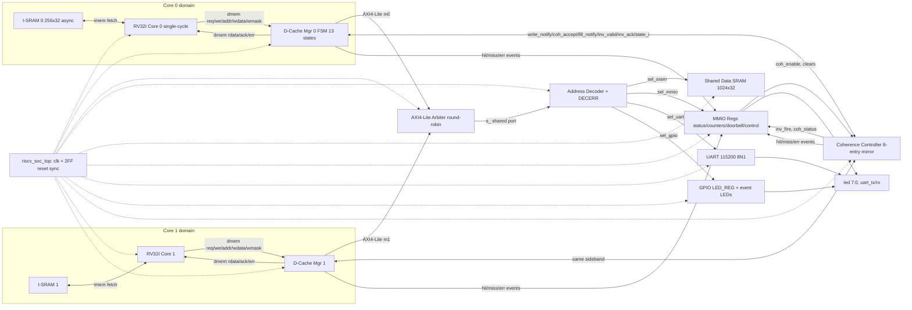

# 10 — System Block Diagram (T1.5a)

Acceptance: *all modules, connections, addresses shown*. Addresses live in doc 11; this page is the
complete connectivity picture. Domains: Core 0 / Core 1 (compute), Coherence (control), Interconnect
(AXI4-Lite), Memory & Peripherals.

---

## 10.1 Full block diagram

```
══════════════════════════ CORE 0 DOMAIN ══════════════════════════╗
                                                                   ║
 ┌──────────────┐  imem_addr/imem_rdata   ┌───────────────────┐    ║
 │  I-SRAM 0    │◄───────────────────────►│                   │    ║
 │  (256×32,    │   (private fetch path,  │  RV32I CORE 0     │    ║
 │   async rd,  │    NOT via AXI/coherence)│  single-cycle    │    ║
 │   $readmemh) │                          │  RUN/STALL FSM   │    ║
 └──────────────┘                          └───────┬───────────┘    ║
                                                   │ dmem_req/we/addr/wdata/wmask
                                                   │ ◄── dmem_rdata/ack/err
                                            ┌──────▼───────────┐    │
                                            │  D-CACHE MGR 0   │    │
                                            │  d_cache + FSM   │    │
                                            │  (doc 04, 13 st) │    │
                                            └──┬────────────┬──┘    │
                     write_notify0/addr0 ──────┤            │       │
                     ◄── coh_accept0 ──────────┤            │       │
                     fill_notify0/idx0 ────────┤            │       │
                     ──► inv_valid0/idx0 ──────►│            │       │
                     ◄── inv_ack0 ──────────────┘            │       │
                                       AXI4-Lite master 0    │       │
                                       (aw/w/b + ar/r)       │       │
                                              └──────┬───────┘       │
                                                     │               │
══════════════════════════ INTERCONNECT DOMAIN ══════▼═══════════════╣
                                                                     ║
   ┌────────────────────── from CORE 1 DOMAIN (same structure) ────┐  ║
   │  AXI4-Lite master 1                                           │  ║
   └──────────────────────────────┬────────────────────────────────┘  ║
                                  ▼                                   ║
                        ┌──────────────────┐                          ║
                        │ AXI4-LITE ARBITER│  round-robin, grant-held │
                        │   (doc 06)       │──► pref flips per txn    ║
                        └────────┬─────────┘                          ║
                                 ▼ shared slave port (s_*)            ║
                        ┌──────────────────┐                          ║
                        │ ADDRESS DECODER  │ + DECERR slave FSM       ║
                        │   (doc 07)       │                          ║
                        └─┬────┬─────┬────┬┘                          ║
          sel_sram  ──────┘    │     │    └────── sel_gpio            ║
              │       sel_mmio │     │ sel_uart                       ║
              ▼                ▼     ▼        ▼                       ║
════════════ MEMORY & PERIPHERALS DOMAIN ═════════════════════════════╣
                                                                     ║
 ┌───────────────────┐  ┌──────────────────┐  ┌────────────┐  ┌────┴─────┐
 │ SHARED DATA SRAM  │  │    MMIO REGS     │  │    UART    │  │  GPIO/LED│
 │ 1024×32 reg array │  │ COH_STATUS       │  │ TX/RX FSMs │  │ LED_REG  │
 │ AXI slave, 1-cyc  │  │ INV/HIT/MISS cnt │  │ baud 115200│  │ + event  │
 └───────────────────┘  │ DOORBELL/CONTROL │  │ 8N1 TX/RX  │  │  stretch │
                        └──────▲───────────┘  └────────────┘  └──┬───────┘
                               │ counters/events: inv_fire,      │ led[7:0] pins
                               │ hit0|1, miss0|1, err_event,     │ uart_tx/rx pins
                               │ coh_enable/err_clear/cnt_clear  │
                               │                                 │
══════════════════════ COHERENCE DOMAIN ═════════════════════════════╣
                                                                     ║
                     ┌────────────────────────────────────┐          ║
   notify/accept     │        COHERENCE CONTROLLER        │          ║
   fills  ──────────►│  8-entry mirror (4 lines × 2 cores)│          ║
   ◄─ inv_valid/idx ─│  4-state FSM (doc 05)              │          ║
   ──► inv_ack ──────│  dispatch = remote state != I      │          ║
   ◄─ state0/1_i ────│  INV_COUNT, inv_fire, coh_status   │          ║
                     └────────────────────────────────────┘          ║
                                                                       ║
════════════════════════════ TOP: riscv_soc_top ═══════════════════════╝
   clk ──► all modules        rst_n ──► 2-FF reset synchronizer ──► all modules
   (FPGA: fpga_top wraps with MMCM 100→50 MHz; see doc 12)
```

## 10.2 Mermaid (renders on GitHub)



## 10.3 Connection inventory (count of every inter-module bundle)

| # | From | To | Bundle | Notes |
|---|------|----|--------|-------|
| 1 | rv32i_core N | i_sram N | `imem_addr[31:0]` / `imem_rdata[31:0]` | private, async read |
| 2 | rv32i_core N | d_cache_mgr N | `dmem_req/we/addr/wdata/wmask` | req/ack |
| 3 | d_cache_mgr N | rv32i_core N | `dmem_rdata/ack/err` | |
| 4 | d_cache_mgr N | arbiter | full AXI4-Lite master port `m0_/m1_` + `bus_req` | |
| 5 | arbiter | d_cache_mgr N | granted AXI responses + `grant` (doc 06 §6.4) | |
| 6 | arbiter | decoder | shared AXI4-Lite slave port `s_` | |
| 7 | decoder | each slave | slave AXI port + `sel_*` | 4 slaves + DECERR internal |
| 8 | d_cache_mgr N | coherence_ctrl | `write_notify/addr`, `fill_notify/idx`, `inv_ack`, actual `state/valid` lines | sideband |
| 9 | coherence_ctrl | d_cache_mgr N | `inv_valid/idx`, `coh_accept` | sideband |
| 10 | coherence_ctrl | mmio_regs | `coh_status[15:0]`, `inv_fire` | |
| 11 | d_cache_mgr N | mmio_regs | `hit_event`, `miss_event`, `err_event` | counters |
| 12 | mmio_regs | coherence_ctrl | `coh_enable` | CONTROL bit0 |
| 13 | mmio_regs / top | leds | event LEDs + LED_REG[7:6] | doc 09 §9.4 |
| 14 | top | all | `clk`, `rst_n_sync` (2-FF release) | doc 12 §12.3 |

## 10.4 What is deliberately NOT connected

- Instruction fetch (i_sram) — private path, never through AXI/coherence (FR-5.2, TRD §5 note).
- Invalidation signals — sideband wires only, never routed over AXI (D8).
- No core-to-core direct connection exists; all sharing happens through shared SRAM + the coherence
  controller. No interrupts, no CSRs, no debug module (scope exclusions).
